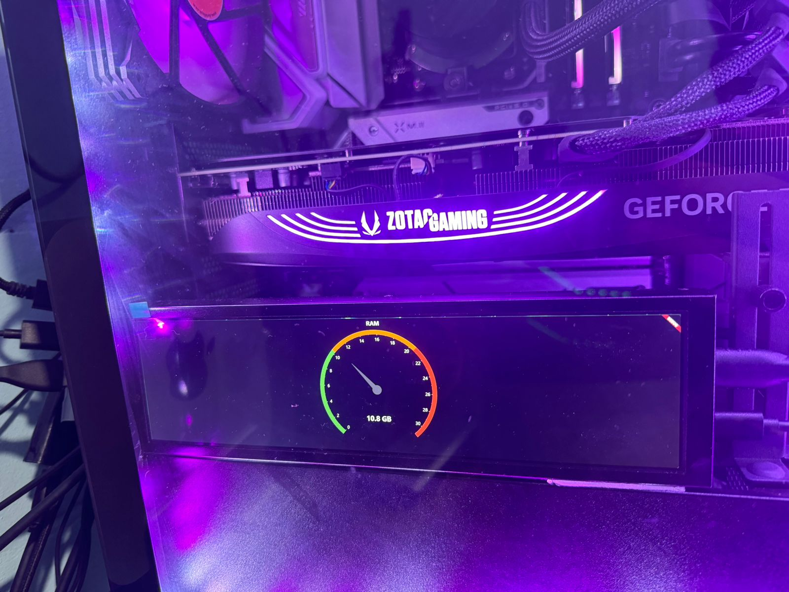

# Simple Hardware Monitor

Monitor de hardware en flutter para pantalla 1920x480 usando el servicio web de Open Hardware Monitor https://openhardwaremonitor.org/

## Ram

Se visualiza la ram usada y la total

